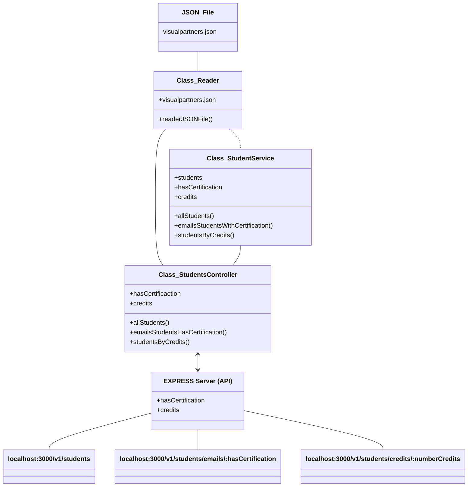

# Code Challenge  

Diagrama del proyecto:   

Uso de dependencias:   

 - Gestor de paquetes    
 - Framework para pruebas para JavaScript     
 - Framework de desarrollo para Node.js    
 - Herramienta para cuidar la legibilidad del código   

Uso de la API:   

- Mensaje de bienvenida    

- Obtener la lista de todos los estudiantes, ingresar a http://localhost:3000/v1/students   

- Obtener un arreglo con los emails de los estudiantes que tienen o no certificación.   
  Entrando a http://localhost:3000/v1/students/emails/true se extraen los correos de los estudiantes con certificación.
  
  A http://localhost:3000/v1/students/emails/false los que no tienen certificación.   
  

- Obtener la lista de estudiantes que tengan arriba de cierto numero de créditos, entrando a http://localhost:3000/v1/students/credits/:creditos donde ':creditos' se modifica por el numero por el que se desea filtrar.   Ejemplo:   

  

