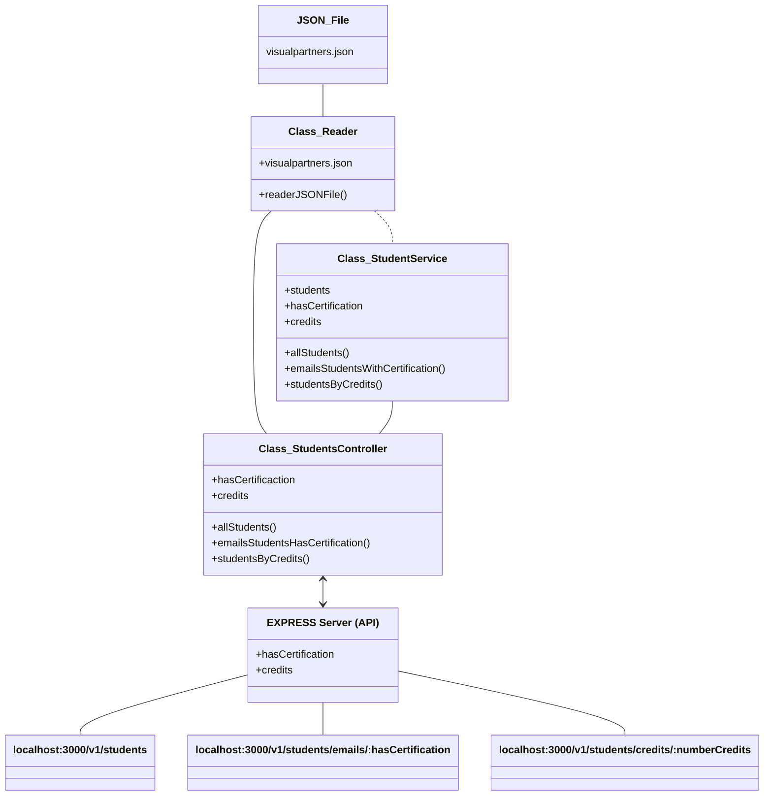

# Code Challenge 

Diagrama del proyecto:

Uso de dependencias:

 - Gestor de paquetes  
 - Framework para pruebas para JavaScript   
 - Framework de desarrollo para Node.js  
 - Herramienta para cuidar la legibilidad del código

Uso de la API:

-Mensaje de bienvenida

